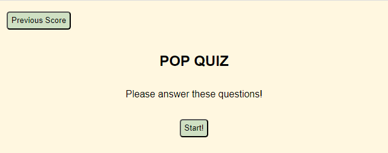
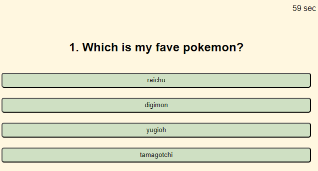
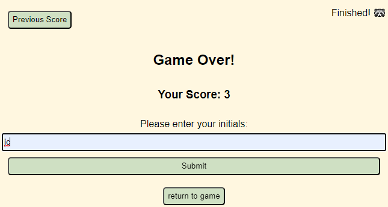
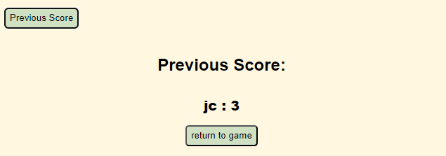

# Quick Quiz!

## 04 Web APIs: Code Quiz

For this challenge, we're tasked with making a quiz from scratch; this time using JavaScript to add functionality! I had to review so many notes, look up so many things, take mental health breaks, and break it down to tiny pieces for this one! I literally studied Objects for a day, and event objects are still confusing to me(especially when using them with an eventListner and function). Some of the most important concepts making my code work was definitely scope and code placement. I also got some best practices reiterated to me such as: placing variables on top, eventListeners at the bottom, and to try not to complicate things too much. It was definitely a challenge stringing my thought process of: When this happens, I want this to happen; and then adding the functionality of HOW to make it happen. I am learning a lot for sure! 

One of the biggest struggles for me for this challenge was adding functionality to all the choice buttons, as well as getting a different option to display on all of them in a more concise manner. I think this stumped me for a few days!
Originally I tried adding an eventListener to my optionBtns, which didn’t work as it was an array. So I tried to loop though the array to add an eventListener to each button in it! But that ended up being messy, so I got some guidance to add functionality that targets the parent container instead and then narrow it down so that it would only work if I clicked on specific things (buttons) within the target container (Compagnoni,2023)! 
The other part was figuring out how to condense my code of adding a new question/option to every new page of my quiz. Originally my loop made it so that it just iterated through the whole thing and ended up at the last question. I was working with 2 live variables in this one, so I was a bit confused. I got the majority of the equation down, I was just confused on how to change the questionNum variable per click, and with help realised that if I declared the variable in the global scope, it could be used everywhere and functions below the declaration would still affect the value how I wanted it (Compagnoni,2023)! 

I’m now wondering how many webpages actually load, because I always thought normally when I clicked on something it would just bring me to like a new webpage, rather than dynamically changing it after an event? 


## Table of Contents

- [Deployment](#deployment)
- [Requirements](#requirements)
- [Usage](#usage)
- [Citations](#citations)
- [License](#license)

## Deployment

Link to my mini quiz: 

**https://jaychan0125.github.io/Quick-Quiz/**

## Requirements

Here are the provided requirements:
### User Story
```
AS A coding boot camp student
I WANT to take a timed quiz on JavaScript fundamentals that stores high scores
SO THAT I can gauge my progress compared to my peers
```

### Acceptance Criteria
```
GIVEN I am taking a code quiz
WHEN I click the start button
THEN a timer starts and I am presented with a question
WHEN I answer a question
THEN I am presented with another question
WHEN I answer a question incorrectly
THEN time is subtracted from the clock
WHEN all questions are answered or the timer reaches 0
THEN the game is over
WHEN the game is over
THEN I can save my initials and my score
```

## Usage

 
When first entering the quiz, you'll be given instructions to answer the quiz questions! Start by hitting the 'Start!' button!

 
After you start, you'll be given a question with 4 options for answers! A timer will also start giving you 60seconds to complete the quiz. Every answer you click will bring you to the next question! 

 
Be careful! If you answer wrong, you'll lose 5seconds off your time! If the time runs out, the game is over!   

 
Once done, you'll be prompted to put your initials in to save your score! Hit the 'Submit' button to do so! Your score is the amount of time you have left. You can view your previous score, but pressing the 'Previous Score' button.

 
As shown here! I'm sure you can beat my score! You'll also have a button return to the start page of the game.


## Citations

Maqsood, A., Moatar, T., Krishna, &amp; Zhang, S. (2023). Web APIs Day 1-3. Lecture. 

Compagnoni, J. (2023). Tutoring.

## License

Licensed under the MIT license.

---


